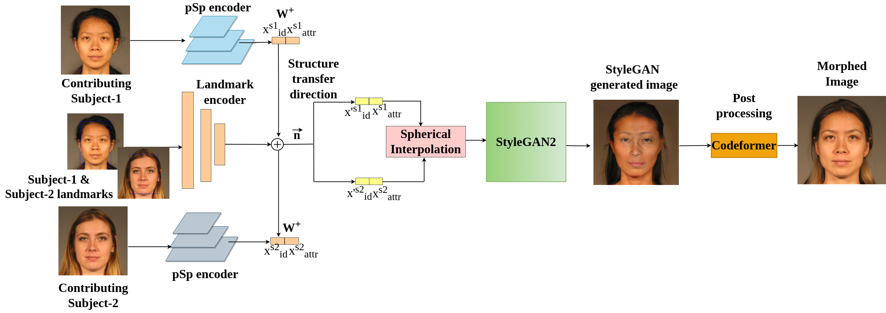
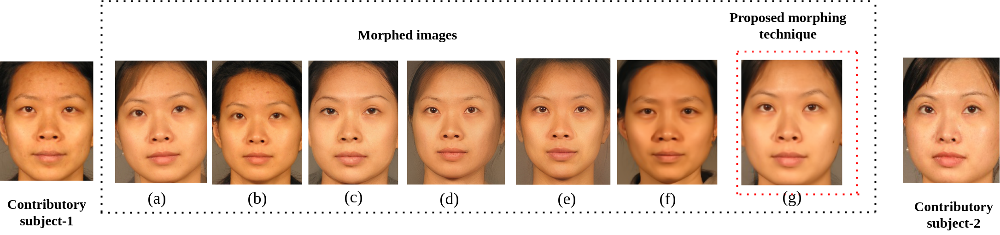

# MLSD-GAN: Generating Strong High Quality Face Morphing Attacks Using Latent Semantic Disentanglement [[paper]](https://ieeexplore.ieee.org/document/10464945)
Face-morphing attacks are a growing concern for biometric researchers, as they can be used to fool face recognition systems (FRS). These attacks can be generated at the image level (supervised) or representation level (unsupervised). Previous unsupervised morphing attacks have relied on generative adversarial networks (GANs). More recently, researchers have used linear interpolation of StyleGAN-encoded images to generate morphing attacks.
In this paper, we propose a new method for generating high-quality morphing attacks using StyleGAN disentanglement. Our approach, called MLSD-GAN, spherically interpolates the disentangled latents to produce realistic and diverse morphing attacks. We evaluate the vulnerability of MLSD-GAN on two deep-learning-based FRS techniques. The results show that MLSD-GAN poses a significant threat to FRS, as it can generate morphing attacks that are highly effective at fooling these systems.
# Requirements 
    python >=3.6, pytorch==1.5.0 torchvision==0.6.0
# Block diagram
  

  
  
<em>Block diagram of the proposed MLSD-GAN for generating high quality morphed face images</em>

# Quantitative results
  

  
  
<em> Qualitative results of the proposed MLSD-GAN with existing methods a) Landmarks-I b) Landmarks-II, c) StyleGAN, d) MIPGAN-1 e) MIPGAN-II,
f) Morrdiff g) Proposed method</em>

